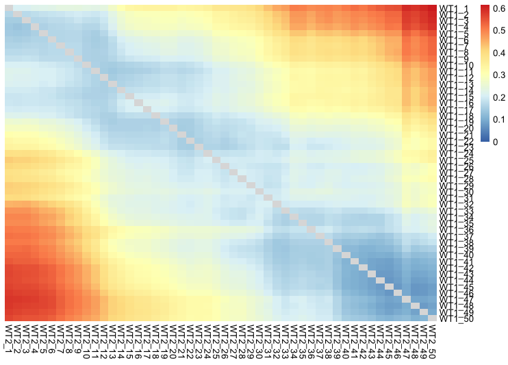

<p align="center"> Trajectory Alignment of Gene Expression Dynamics </p>

<p align="center"> https://www.biorxiv.org/content/10.1101/2022.12.21.521424v1 </p>

# Introduction to TrAGEDy method
While the study of an organism or biological process by itself is important, understanding the effect of the environment or conditions on an organism or biological process is also critical. Whether this be genetic, nutrient, environmental or disease conditions; understanding what genes define the differences across these conditions can help us better understand the underlying process/organism in general. 

Using TrAGEDy we can find the common alignment between the two conditions, identifying what cells are undergoing a similar biological process between the two conditions.

TrAGEDy can then arrange the cells on a common pseudotime axis in order to pull out genes which are differentially expressed between the conditions at different points in the shared process.

# Installing TrAGEDy

To install TrAGEDy, download the 'TrAGEDy_functions.R' script from this github and source it within your R session
```
source("/path/to/TrAGEDy_functions.R")
```

# Worked Example

To aid in the use of TrAGEDy we have layed out a worked example using a scRNA-seq datasets from Briggs et al, 2020. In this datasets there are cells from the bloodstream form stages of the parasite Tryanosoma brucei under a WT and knockout condition. Under WT conditions, the parasite transitions from a slender to stumpy form, but when the gene ZC3H20 is knocked out, this transition is blocked. 

For simplicity, we will only align the first WT replicate with the ZC3H20 KO dataset. As shown in the TrAGEDy paper, replicates can be aligned with TrAGEDy and merged into one dataset before alignment between the conditions.

We need to library some dependencies before starting TrAGEDy

```
library(slingshot)
library(RColorBrewer)
library(Seurat)
library(SingleCellExperiment)
library(ggplot2)
library(dplyr)
library(stats)
library(stringr)
library(rgl)

setwd("path/to/TrAGEDy_example.R")
```

## Step 1 - Create trajectories 

TrAGEDy makes no assumptions about what Trajectory Inference package is used, it only requires that the trajectories be linear in nature. For this analysis we used Slingshot from Street et al, 2018 to construct a trajectory based off of reduced dimension embeddings from PHATE (Moon et al, ). Before a trajectory is made, the user first needs to supply a vector of genes which will be used to build the trajectory and calculate gene expression dissimilarity scores between the conditions.

We supply the objects with pseudotime already included, as well as the feature space gene list. While we are setting up our Zenodo, please contact us for the WT and KO files.

```
WT_1_sce <- readRDS("WT_1_sce.rds")
WT_2_sce <- readRDS("WT_2_sce.rds")

features <- read.csv("feature_space.csv", row.names = 1)
features <- features$x
```

## Step 2 - Create interpolated points

TrAGEDy uses cellAlign's method for creating interpolated points with some minor adjustments. First, the user decides how many interpolated points will be created across the trajectory and how big the window size should be. We chose 50 interpolated points for our analysis and we wanted the window size to mean adjacent interpolated points had mixes of cells being considered.

```
pseudo_end <- max(WT_2_sce$slingPseudotime_1, WT_1_sce$slingPseudotime_1)
window <- pseudo_end / 45

WT_1_tree <- nodePseudotime(WT_1_sce,"slingPseudotime_1","cell_type", 50, "WT1")
WT_2_tree <- nodePseudotime(WT_2_sce,"slingPseudotime_1","cell_type", 50, "WT2")
```

We then use the window size to get gene expression values for the interpolated points. A larger window size means interpolated point gene expression will be influenced by more cells further away from it and vice versa. As cell density is not uniform across trajectories, it is unwise to apply the same window size to all the interpolated points as this will lead to some interpolated points gene expression only being influenced by a small amount of cells, leading to a unsmooth gene expression profile. TrAGEDy avoids this, by increasing the window size around interpolated points with few cells in it's pseudotime area.


```
WT_1_node_exp_mtx <- nodeExpressionEstimate(WT_1_sce@assays@data@listData$logcounts, WT_1_tree, window, adjust.window = T)
WT_2_node_exp_mtx <- nodeExpressionEstimate(WT_2_sce@assays@data@listData$logcounts, WT_2_tree, window, adjust.window = T)

```

We then subset the gene expression matrices if the interpolated points to only include genes which are in our feature space

```
WT_2_node_exp_mtx  <- WT_2_node_exp_mtx[ features, ]
WT_1_node_exp_mtx <- WT_1_node_exp_mtx[ features, ]
```

## Step 3 - Find Alignment path

We next need to find the optimal path through the data. First we find how much dissimialtity there is between the interpolated points of the conditions. The user chooses what method of calculating dissimilarity is used (Euclidean distance, Pearson, Spearman) but we recommend Spearman's correlation, as it performed best on the simulated datasets. 

A common way to find the path through a process is with Dynamic Time Warping (DTW), but DTW requires every point in the process be matched, but for our process being analysed, the WT has cells (stumpy's) that will not be represented in the ZC3H20 KO, and thus matching them together would be nonsensical. TrAGEDy avoids this issue by finding the lowest dissimilarity points at the start and end of the process and cutting out everything that falls outside of it. This means we can apply DTW fully, returing us the optimal path through the data.

```
penalty_mtx_cut <- dis_mtx_calculator(as.matrix(WT_1_node_exp_mtx), as.matrix(WT_2_node_exp_mtx), "spearman")

path_tragedy <- bootstrap_pathfind(sequence_1 = as.matrix(WT_1_node_exp_mtx), sequence_2 = as.matrix(WT_2_node_exp_mtx)
                        , similarity_method= "spearman", threshold_method = "mean")
```
We can then cut high dissimilarity matches that occur somewhere between the start and end points

```
path_tragedy_cut <- cut_deviate(path_tragedy[[1]], penalty_mtx_cut, method = "mean")

```

We can then visualise how the alignments look through various means.

The path of the data through the matrix

```
PlotAlignment(path_tragedy_cut, penalty_mtx_cut)
```



or with visualisation of the pseudotime of the interpolated points and their matches

```
PlotOutput(WT_1_tree, WT_2_tree, path_tragedy_cut)
```


## Step 4 - Adjust pseudotime of interpolated points and cells
Using the alignment path, we can then adjust the pseudotimes of the interpolated points, with matched interpolated points having a similar pseudotime value.

```
alignedPoints <- chunk_node(WT_1_tree$node_pseudotime, WT_2_tree$node_pseudotime, path_tragedy_cut)

WT_1_tree_aligned <- WT_1_tree
WT_1_tree_aligned$node_pseudotime <- alignedPoints$condition_1$pseudotime
names(WT_1_tree_aligned$node_pseudotime) <- row.names(alignedPoints$condition_1)

WT_2_tree_aligned <- WT_2_tree
WT_2_tree_aligned$node_pseudotime <- alignedPoints$condition_2$pseudotime
names(WT_2_tree_aligned$node_pseudotime) <- row.names(alignedPoints$condition_2)

```

We can then visualise the changes in pseudotime based on the alignment path

```
PlotOutput(WT_1_tree_aligned, WT_2_tree_aligned, path_tragedy_cut)
```


Finally we adjust the pseudotime of the individual cells based on the new pseudotimes of the interpolated points
```
WT_1_cell_pseudo_new <- pseudo_cell_align(WT_1_tree$cell_pseudotime, alignedPoints$condition_1 , WT_1_tree$node_pseudotime, window)
WT_2_cell_pseudo_new <- pseudo_cell_align(WT_2_tree$cell_pseudotime, alignedPoints$condition_2 , WT_2_tree$node_pseudotime, window)

```
We save the results back into the object
```
WT_2_sce$oldPseudotime <- WT_2_sce$slingPseudotime_1
WT_2_sce$newPseudotime <- WT_2_cell_pseudo_new$pseudotime
WT_1_sce$oldPseudotime <- WT_1_sce$slingPseudotime_1
WT_1_sce$newPseudotime <- WT_1_cell_pseudo_new$pseudotime
WT_2_sce$Status <- as.factor(WT_2_cell_pseudo_new$status)
WT_1_sce$Status <- as.factor(WT_1_cell_pseudo_new$status)
```

## Step 5 - Perform TrajDE

Having found the optimal path, we can then identify what genes are differentially expressed (DE) between the two conditions before they diverge from one another. To do this we utilise a sliding window (akin to soft clustering) where the user defines how many windows of comparison will be made, and how many matched interpolated points will be shared between the windows as it slides across the aligned process. The user can also define what statistical test they would like to use (T test, Mann Whitney U test) and what log fold change or minimum percentage thresholds they would like to use.
```
output <- TrajDE(list(WT_1_sce, WT_2_sce), list(WT_1_tree_aligned, WT_2_tree_aligned), path_tragedy_cut, n_windows = 4, 
                  overlap = 1, p_val = 0.05, min.pct = 0.1, logfc = 0.5, all.genes = F, test_use = "wilcox", correct = T)

```

## Recreating TrAGEDy paper results

On the following Zenodo project there are the scripts and objects required to recreate the results of the TrAGEDy paper: [10.5281/zenodo.13310931](https://doi.org/10.5281/zenodo.13310931)

Download the Zenodo folder and unzip it. The Zenodo folder contains three subdirectories for replicating the simulated, Trypanosoma brucei and T cell analyses. The scripts are numbered based on the order they need to be run, i.e. script 01_[name].R should be run before script 02_[name].R

The scripts contain the variable workingDirPath. Please put the path to the Zenodo folder to ensure smooth running of the scripts.

The PHATE seed has been set to 1 in all the scripts, however we've noticed that the results can still change between users. We have included the PHATE space objects in the Zenodo, incase the PHATE space for the datasets cannot be replicated.


